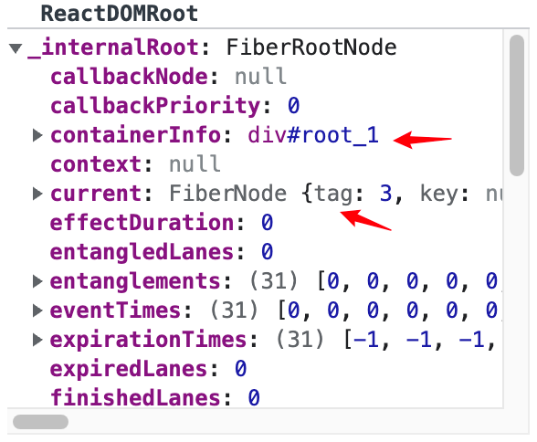

# 实例化应用

初次渲染实例化应用时会创建许多虚拟节点，用于记录状态从而渲染页面。
下面描述下各个节点之间的关联关系。

---

### 大致流程

1. 创建 <code>ReactDOMRoot</code> 时会检查当前 <code>Dom</code> 上是否已经存在 <code>ReactDOMRoot</code> 存在则抛出错误
2. 执行 <code>createContainer</code> 创建 <code>FiberRoot</code> <code>HostRootFiber</code>
3. 将 <code>FiberRoot</code> <code>HostRootFiber</code> 进行关联
4. 初始化 <code>HostRootFiber.memoizedState</code> <code>HostRootFiber.updateQueue</code>
5. <code>markContainerAsRoot</code> 关联 <code>Dom</code> <code>HostRootFiber</code>
6. <code>listenToAllSupportedEvents</code> 时间相关
7. 返回 <code>ReactDOMRoot</code>

### 运行流程

<iframe src='https://docs.qq.com/flowchart/DTFVpaVBqT1dLc1da' width='900' height='600' ></iframe>

### 节点截图

