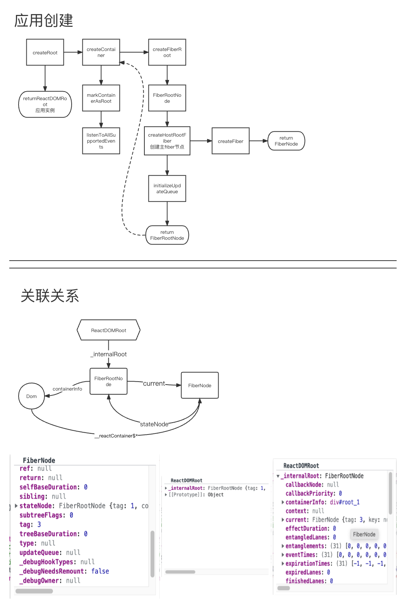

# 首次渲染

初次渲染实例化应用时会创建许多虚拟节点，用于记录状态从而渲染页面。
下面描述下各个节点之间的关联关系。

---

#### 生成节点

- container 应用实例挂载的 Dom 节点
- createRoot() 返回 ReactDOMRoot 应用实例
- createContainer() 返回 FiberRootNode 根节点
- createHostRootFiber() 返回 FiberNode 组件节点

#### 关联关系

- 1.FiberRootNode.containerInfo = container
- 2.FiberRootNode.current = FiberNode
- 3.FiberNode.stateNode = FiberRootNode
- 4.container.\_\_reactContainer$\* = FiberNode
- 5.ReactDOMRoot.\_internalRoot = FiberRootNode

#### Fiber 类型

- tag = ConcurrentRoot = 1 并发模式 FiberRootNode
- tag = HostRoot = 3 主 fiber FiberNode

#### render 方法

- 首次渲染会去查找是否有已经存在的 fiberTree
- 不存在 则为初始挂载流程 完整的构建一次 fiberTree
- 存在 则为更新流程

---

### 运行流程

